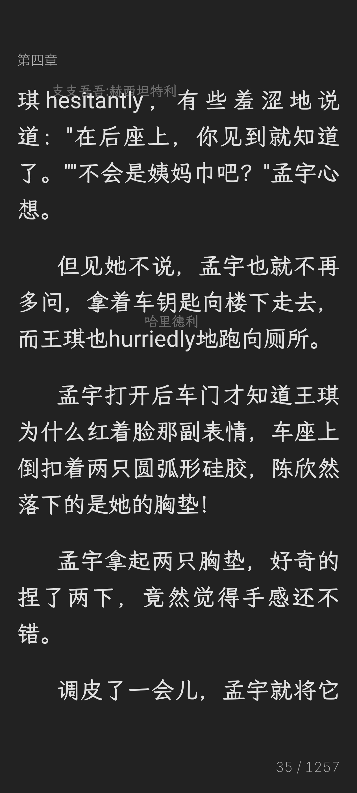

# Readest — 词汇注释版

在阅读中文小说时，自动将部分词汇替换为英文并标注谐音，让你边看小说边学英语。

---

## 效果演示

  
  &nbsp;
  

如上图所示，文中部分中文词汇被替换为英文（如 "hurriedly地"、"hesitantly"），同时在行间标注了中文谐音提示，读者在阅读故事的过程中自然接触和习得英语词汇。

---

## 怎么工作的

**1. 智能选词**
AI 分析当前页面内容，智能挑选适合替换的中文词汇（常见名词、动词、形容词等）。

**2. 翻译 + 谐音**
选中的词汇被替换为英文翻译，同时在文字上方显示中文谐音（近似读音），让你知道这个词怎么读。

**3. 自然习得**
不需要刻意背单词。读着读着，同一个英文词反复出现，结合上下文你就自然记住了。

**4. 掌握标记**
已经学会的词汇会被标记为"已掌握"，以后不再替换，让学习进度一目了然。

---

## 核心机制

- **词汇曝光追踪** — 记录每个词汇在阅读中出现的次数，达到阈值后自动标记为已掌握
- **词汇银行** — 所有学过的词汇保存在本地，随时可以翻出来复习
- **分级词汇表** — 根据你的英语水平选择合适的词汇难度，不会太难也不会太简单
- **每本书独立测验** — 读完一本书后生成专属词汇测验，检验你的词汇习得效果

---

## 致谢

本项目基于 [Readest](https://github.com/readest/readest) 二次开发，Readest 本身是 [Foliate](https://github.com/johnfactotum/foliate) 的现代重写版本。

词汇注释功能使用 [DeepSeek API](https://deepseek.com) 提供 AI 翻译能力。

---

## License

[GNU Affero General Public License v3](LICENSE)
